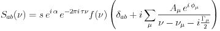

# GWignerfit

GWignerfit is the swiss army knife of experimental quantum chaos for the
analysis (and acquisition) of microwave resonator spectra.

The main purpose is the simultaneous fitting to the sum of a large number of
Breit-Wigner shaped resonances to the transmission or reflection spectra. 

From this various statistical measures such as the
nearest-neighbour-distribution can be calculated and length spectra are
accessible by Fourier transform of the data.

For details of its use and purpose please see the detailed manual in the `doc`
folder.

GWignerfit is built using C, Gtk and Glib.

## Contact

For any comments and/or bug reports please report to the author,
schaefer@scphys.kyoto-u.ac.jp.
